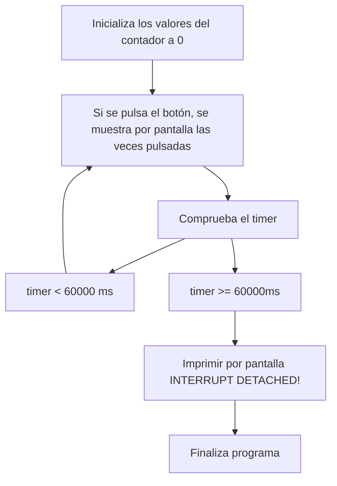
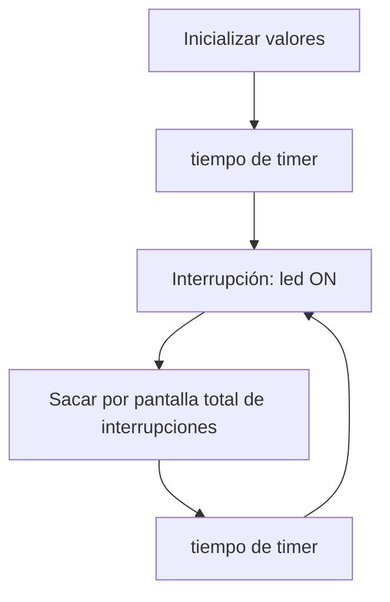

# Procesadores digitales - Práctica 2

## Objetivo
<div align="justify">

El objetivo de esta práctica consiste en comprender el funcionamiento de las interrupciones. Para ello dividiremos la práctica en dos partes: la primera donde las interrupciones ocurrirán cuando pulsemos "el interruptor" y la segunda, que será una interrupción con timer.

## A: Interrupción por GPIO

El código de esta primera parte es el siguiente:

</div>

```cpp
struct Button {
  const uint8_t PIN;
  uint32_t numberKeyPresses;
  bool pressed;
};

Button button1 = {18, 0, false};

void IRAM_ATTR isr();

void setup() {
  Serial.begin(115200);
  pinMode(button1.PIN, INPUT_PULLUP);
  attachInterrupt(button1.PIN, isr, FALLING);
}
static uint32_t lastMillis = 0;

void loop() {
  if (button1.pressed) {
      Serial.printf("Button 1 has been pressed %u times\n", button1.numberKeyPresses);
      button1.pressed = false;
  }

  //Detach Interrupt after 1 Minute
  if (millis() - lastMillis > 60000) {
    lastMillis = millis();
    detachInterrupt(button1.PIN);
     Serial.println("Interrupt Detached!");
  }
}

void IRAM_ATTR isr() {
  button1.numberKeyPresses += 1;
  button1.pressed = true;
}
```

<div align="justify">

En primer lugar, declaramos una estructura `Button` que nos servirá para simular un interruptor. Inicializamos a zero el contador que cuenta las veces que pulsamos el interruptor, asignamos el pin 18 a la salida y asignamos el booleano `pressed` en `false`. 

Después se declara una función `IRAM_ATTR isr()`. Su trabajo consiste en contar las veces que se pulsa el botón i cambiar el booleano de pulsado a `true`.

A continuación, nos encontramos con el `void setup()` donde se declara la velocidad de transmisión a 115200 (`Serial.begin(115200)`) i el pin de nuestro botón como input.

I por último el `void loop()` formado por dos condicionales if:
* El primero se dedica a mostrar por pantalla, las veces que ha sido pulsado el botón i modifica el estado de pulsado a `false`.Este condicionante se ejecuta cada vez que se pulsa el botón. 
* El segundo se encarga de parar el programa i mostrar por pantalla `Interrupt Detached!` una vez llegados los 600000 milisegundos.

La salida de este código es el siguiente:
```cpp
Button 1 has been pressed 1 times
Button 1 has been pressed 2 times
Button 1 has been pressed 3 times
...
Button 1 has been pressed 'x' times
Interrupt Detached!
```
</div>

### Diagrama de flujo



## B: interrupción por timer

<div align="justify">

Para empezar, declaramos las variables que nos servirán para contar el número de interrupciones generadas: `interruptCounter` y `totalinterruptCounter`. Dado que la primera de ellas se compartirá entre el `void loop()` y la función `void IRAM_ATTR onTimer()`, esta será de tipo `volatile` lo que evitará que se elimine debido a las optimizaciones del compilador. A diferencia de la segunda, que tan solo será utilizada por el bucle principal y, por lo tanto, no es necesario declararla como volátil. 

```cpp
volatile int interruptCounter;
int totalInterruptCounter;
```

Además, también declararemos una variable del tipo `hw_timer_t * timer` con el valor por defecto a `NULL` y una variable de tipo `portMUX_TYPE timerMux`, que usaremos para cuidar la sincronización entre `void loop()` y `void IRAM_ATTR onTimer()` al modificar una variable compartida. 

```cpp
hw_timer_t * timer = NULL;
portMUX_TYPE timerMux = portMUX_INITIALIZER_UNLOCKED;
```

A continuación, en el `void setup()` empezamos estableciendo la velocidad de bits a `115200` con `Serial.begin(115200)` y, seguidamente, indicamos al programa cuáles son las condiciones en las que se encontrará en cada estado para saber cuando cambiará. Para ello inicializaremos nuestro temporizador `timer` con una llamada a la función `timerBegin(0,80,true)` que devolverá un puntero a la variable del temporizador que declaramos en la sección anterior. Con esta función sabemos el número del temporizador que queremos usar, el valor que establece la rapidez con la que el contador del temporizador está "marcando" y si el contador debe aumentar o disminuir. Justo después, ejecutaremos `timerAttachInterrupt(timer, &onTimer, true)` para adjuntar la interrupción al temporizador pasándole nuestro `timer`, la función llamada cuando se activa la interrupción y el valor `true` para una interrupción del tipo edge; `timerAlarmWrite(timer, 1000000, true)` para configurar el valor de la alarma y la recarga automática del temporizador  con nuestro `timer`, el valor de alarma para generar el evento y si el `autoreload` está activado o desactivado; y `timerAlarmEnable(timer)` para permitir la generación de eventos en el `timer`.

```cpp
void setup() {
  Serial.begin(115200);
  timer = timerBegin(0, 80, true);
  timerAttachInterrupt(timer, &onTimer, true);
  timerAlarmWrite(timer, 1000000, true);
  timerAlarmEnable(timer);
}
```

En el bucle principal verificaremos si `interruptCounter` es mayor que zero con `if (interruptCounter > 0)`, si se cumple decrementaremos esa variable pues se ha detectado una interrupción. Como la variable se comparte con `onTimer`, esta acción estará dentro de una sección crítica entre `portENTER_CRITICAL` y `portEXIT_CRITICAL` con el parámetro de entrada `timerMux`. En conclusión, en el `loop` nos encargaremos de incrementar el contador con el número total de interrupciones que ocurrieron desde el comienzo del programa e imprimirlo en el puerto serial. 

```cpp
void loop() {
  if (interruptCounter > 0) {
    portENTER_CRITICAL(&timerMux);
    interruptCounter--;
    portEXIT_CRITICAL(&timerMux);
 
    totalInterruptCounter++;
 
    Serial.print("An interrupt as occurred. Total number: ");
    Serial.println(totalInterruptCounter);
  }
}
```

Como último paso, la función `IRAM_ATTR onTimer()` incrementará el contador de interrupciones cada vez que se le indique que ocurrió una interrupción en el ciclo principal. Esto se hará dentro de una sección crítica, declarada con `portENTER_CRITICAL_ISR` y `portEXIT_CRITICAL_ISR`, recibiendo como parámetros nuestra variable del tipo `portMUX_TYPE`.

```cpp
void IRAM_ATTR onTimer() {
  portENTER_CRITICAL_ISR(&timerMux);
  interruptCounter++;
  portEXIT_CRITICAL_ISR(&timerMux);
}
```
Con lo que le código entero para esta segunda parte de la práctica es el siguiente:

```cpp
volatile int interruptCounter;
int totalInterruptCounter;
 
hw_timer_t * timer = NULL;
portMUX_TYPE timerMux = portMUX_INITIALIZER_UNLOCKED;

void IRAM_ATTR onTimer();

void setup() {
  Serial.begin(115200);
  timer = timerBegin(0, 80, true);
  timerAttachInterrupt(timer, &onTimer, true);
  timerAlarmWrite(timer, 1000000, true);
  timerAlarmEnable(timer);
}
 
void loop() {
  if (interruptCounter > 0) {
    portENTER_CRITICAL(&timerMux);
    interruptCounter--;
    portEXIT_CRITICAL(&timerMux);
 
    totalInterruptCounter++;
 
    Serial.print("An interrupt as occurred. Total number: ");
    Serial.println(totalInterruptCounter);
  }
}

void IRAM_ATTR onTimer() {

  portENTER_CRITICAL_ISR(&timerMux);
  interruptCounter++;
  portEXIT_CRITICAL_ISR(&timerMux);
}
```
Con la salida siguiente:

```cpp
An interrupt as occurred. Total number: 1
An interrupt as occurred. Total number: 2
An interrupt as occurred. Total number: 3
An interrupt as occurred. Total number: 4
An interrupt as occurred. Total number: 5
...
```

</div>

### Diagrama de flujo


